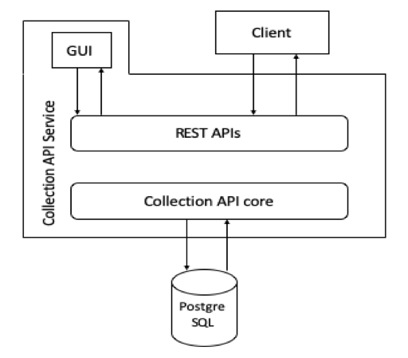
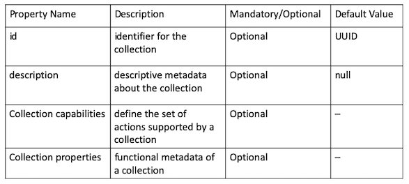
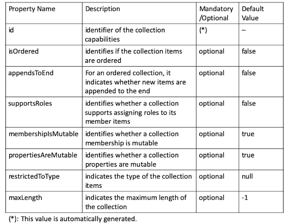
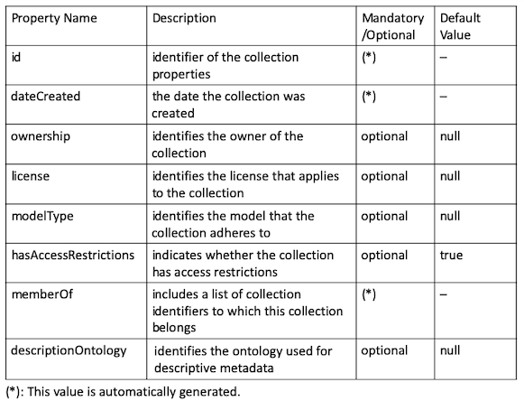
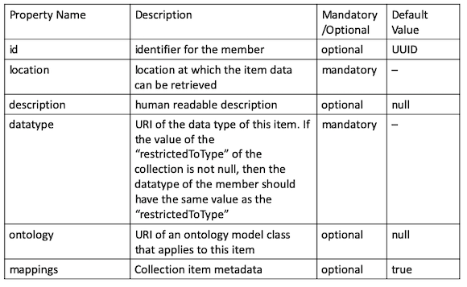
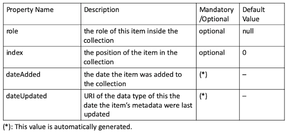

.. _collection-implementation:

++++++++++++++++++++++++++++++++
3. Collection API Implementation
++++++++++++++++++++++++++++++++
*******************************
3.1 Collection API Architecture
*******************************
The architecture of the Collection API service is illustrated in the figure below. The bottom component is the Collection API core, which includes the collection 
implementation. The service contains various REST APIs responsible for interacting with users and thus enabling collections and collection items management. 
Moreover, the service offers a graphical web frontend in order to visualize managed collections, collection items and relationships between them. The web frontend 
is available under http://{hostname}:{port}/static/overview.html. In addition, an intuitive graphical user interface will be developed in the future by SCC.

   
   Figure 1: Collection API architecture
   
**************
3.2 Data Model
**************

**3.2.1 Service Features**

The table below includes the different service-level features this implementation offers.

+--------------------------------------+
| serviceFeatures                      |
+======================================+
| | providesCollectionPids: false      |
| | collectionPidProviderType: null    |
| | enforcesAccess: false              |
| | supportsPagination: true           |
| | asynchronousActions: false         |
| | ruleBasedGeneration: false         |
| | maxExpansionDepth: -1              |
| | providesVersioning: false          |
| | supportedCollectionOperations: null|
| | supportedModelTypes: null          |
+--------------------------------------+

**3.2.2 Collection Object**

The service offers the possibility to create and manage collections and collection items. The figure below includes a data model of a collection, collection item and the relationship between them.

   
   Figure 2: Collections and collection items

- Collection: includes the following attributes:
    

   

1. Collection capabilities: comprise the following attributes, which determine the possible actions on a collection.
    

2. Collection properties: include collection’s metadata.

- Collection Item: In order to create a new collection item, the following attributes are expected to be given by the user:

1. Mappings: include the following attributes:

